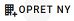
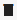

# Fullstack opgave
I forbindelse med anden samtale hos Ivaldi ApS har jeg løst følgende opgave stillet af Ivaldi:

>Implementér et projekt, hvor man skal kunne håndtere virksomheder med nogle få stamdata. Systemet skal give mulighed for at oprette, redigere, liste og slette virksomheder, samt man skal kunne hente informationer ind fra cvrapi.dk ved indtastning af CVR-nr.
>Backend:
>- .NET Core
>- HotChocolate GraphQL
>- SQLite
>Frontend:
>- Vue.js
>- Typescript
>- Vuetify
>Projektet skal være veldokumenteret og enten afleveres via github eller zip til karriere@ivaldi.dk senest torsdag d. 22. januar kl. 12."

Denne Readme er dokumentation for min løsning af opgaven.

## Overblik
Jeg har defineret et domæne som vist herunder, hvor en bruger administrere en liste af virksomheder identificeret ved virksomhedens CVR-nummer. Virksomheden har et navn, en adresse, et postnummer og by.

	[bruger] 1 -- administrerer -- * [virksomhed] 1 -- har -- 1 [cvr]
	                                  1        
	                                  |        
									 har     
							          |         
                                      1         
					               [navn, Adresse, postnumer, by]

 Løsningen gemmer virksomhederne i en database, hvor løsningen henter virksomhedernes data fra web-sitet cvrapi.dk med cvr-nummeret som nøgle.

 Du kan arbejde med virksomhederne som følger:
 * Oprette en ny virksomhed i databasen ved at indtaste dens cvr-nummer,
 * Redigere en virksomhed,
 * Liste virksomheder,
 * Slette en virksomhed.

Du har en enkel og simpel web-side, hvor du kan udføre alle operationerne.

Stakken i løsningen har Vue i toppen som frontend mod brugeren implementeret i delprojektet _fullstackfe_. Frontend kommunikerer med backend, som er implementeret i delprojektet _fullstackbe_.
 
## Frontend
Dialogen er en web-side, der er organiseret med en overskrift, _Virksomheder_, og en knap  til at oprette en ny virksomhed. Under overskriften er en liste af paneler, der viser alle virksomheder oprettet med deres navn som overskrift i panelerne. Du kan folde ud et panel og se detaljer for virksomheden, som cvr-nummer, adresse, postnummer og by. Der er to knapper i panelet til at redigere  og slette  virkomheden foldet ud.

Til frontend er brugt skabelonen Vuetify for brugerdialoger og layout og programmeret i Typescript, som specificeret i opgaven. Til kommunikationen med backend fra frontend er brugt en Apollo GraphQL klient.

Jeg har valgt at anvende Options-API for implementationen, da der kun er en side, og det er første gang for mig med Vue. Programmet er struktureret med i en SFC, single-file component, VirksomhedMain, der implemtenterer brugerfladen. Det specifikke GraphQL kode er lagt ud i komponenter for sig.

## Backend
I backend er HotChocolate GraphQL brugt som præsentation af en domænet med fire operationer oprette, redigere og slette en virksomhed samt liste alle virksomheder. Backend gemmer virksomhederne i en SQlite database, hvor den bruger Microsoft Entity Framework Core til at under operationerne.

